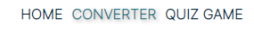

# Metrics Response

Metrics Response is a page intended to be a unit conversion tool and with a proposal to put the logical reasoning of the users into practice with the quiz-game.

It was designed to be simple but functional, with the objective of meeting the need to convert measurements for professional or personal use.

- Here is the link to the final project > [Metrics Response](https://guisgrande.github.io/second-project-ci/)

## Contents

    
Summary

- [UX/UI Design](#uxui-design).
     * [Strategy](#strategy).
     * [Scope](#scope).
     * [Structure](#structure).
     * [Skeleton](#skeleton).
       * [Wireframes](#wireframes).
       * [Flowchart](#flowchart).
     * [Surface](#surface).
       * [Colour scheme](#colour-scheme).
       * [Typography](#typography).
       * [Imagery](#imagery).
   
- [Features](#features).
   * [Existing Features](#existing-features).
     * [Home page](#home-page).
     * [Converter page](#converter-page).
     * [Quiz game page](#quiz-game-page).
   * [Features Left to Implement](#features-left-to-implement).
 
- [Testing](#testing).
   * [Navegation and Devices](#navegation-and-devices).
   * [Validator Testing](#validator-testing).
   * [Performance Testing](#performance-testing).
   * [Other Tests](#other-tests).
   * [User Story Testing](#user-story-testing).
   * [Fixed Bugs](#fixed-bugs).
   * [Unfixed Bugs](#unfixed-bugs).
 
- [Deployment](#deployment).
   * [Deployment](#deployment).
   * [Fork](#fork).
   * [Clone](#clone).
  
- [Technologies and tools](#technologies-and-tools).

- [Credits](#credits). 
   * [Content](#content).
   * [Media](#media)
   * [Inspiration](#inspiration).
 
- [Acknowledgements](#acknowledgements).
 

 

## UX/UI Design

### Strategy

#### Site owner goals

- The website was created to provide a tool for conversions.
- The website was created to give the user the option to test his knowledge and reasoning.
- The website was created to attract people who need to convert frequently.
- The website should be simple to navigate and easy to read.

#### User stories

- As a user, I want to understand the purpose of the website, so I can know if it's of interest to me.
- As a user, I want to easily navigate the site, so I don't lose enthusiasm for using the site.
- As a user, I want to be able to use the tool, so I fulfill the objective that brought me to the site.
- As a user, I want to be able to select more than one conversion option, so I I can fulfill my need.
- As a user, I want to be able to test my knowledge, so I can chalenge my self.
- As a user, I want to have access to all the links, so I can connect if it interests me.

### Scope

- For the Metrics Response I have planned the following features.
    - Use of a clean design, to keep the website simple.
    - Use coherent Java Sricp for the site to be as correct and accurate as possible.
    - Use technologies and tools that improve site development and performance.
 
### Structure

- For the Metrics Response website I planned to separate the site into three pages. 
    - The home page, which will be the landing page of the website, containing only the icons directing to the site's functionalities .
    - The convert page, will contain a field to select the categories, two other fields to select the metrics that will be compared, and inputs for the desired value and another for the answer. It will also contain a button to invert the metrics and another to clear the values.
    - The quiz-game page, will have two buttons for action (play and stop), two fields to count the correct and incorrect points, a timer, a frame to show the question, the rules, and finally the answer options.

### Skeleton

#### Wireframes

- The wireframe was created using the Figma tool. The initial idea of comfort image was maintained during the creation of the code, with some adjustments in the layout to visually adapt the page.

Home Page Wireframe

Converter Page Wireframe

Quiz Game Page Wireframe

### Flowchart

- The flowchart was elaborated to guide the development of the quiz-game logic. Being pointed the possible ways for the user action and how to behave before the established rules.

<details?

### Surface

#### Colour scheme

- The colors chosen for the composition of the site were a combination of 6 colors (white, black, and 4 shades of blue), white or black used for texts and icons, white for the background, and shades of blue to details and gradient of containers. 
- For the quiz-game page I opted to change the background colors to a brighter color. I chose three different shades of yellow to contrast with the quiz elements. 
- Here is an image of the color palette used on the website and the shades of yellow used on quiz page (source: Coolors.io).

    

#### Typography

- The font was selected from Google Fonts.
  - The font selected was Inter (Extra-light 200).
  - For the whole website I chose the same font, just using bold or text-shadow to to give more emphasis.

#### Imagery

- For this project and its proposal, the use of images or other media would not be appropriate. I chose to use only icons to increase the visual aspect.

## Features

### Existing Features

- __Title__

    

- __Navbar__

   
  

- __Footer__

   
  

#### Home page

- __Selector section__

    

#### Converter Page

- __Converter box__

    

#### Quiz game Page

- __Quiz game box__

 
    

### Features Left to Implement

- To be implemented in the quiz-game difficulty options between easy, medium and hard.
- Improve the design of the quiz-game to make it more attractive and fun, like adding animations.
- In the future, expand the options of categories and metrics to offer more options to users.

## Testing

- I ran the tests on multiple devices and different browsers, in order to cover the widest possible range of screen sizes and models. 

### Navegation and Devices

- __Browsers__
  - Chrome
  - Firefox
  - Safari
  - Edge

- __Devices__
  - Apple: Iphone SE, Iphone 13 Pro Max, Iphone 8, Iphone XR, Iphone 12 Pro, Ipad Air, Ipad Mini.
  - Samsung: Galaxy S8+, Galaxy S20 Ultra, Galaxy A51/71, Galaxy Tab S4, Galaxy Note II.
  - Motorola: Moto G4.
  - LG: Optimus L70, Nexus 4, Nexus 5, Nexus 10.
  - Google: Pixel 2, Pixel 5, Pixel 3 XL.

### Validator Testing 

- __HTML__
    - No errors were returned when passing through the official W3C Validator. [Validated](https://validator.w3.org/nu/?doc=https%3A%2F%2Fguisgrande.github.io%2Fsecond-project-ci%2F)

    
All html pages validated

 
1. Home page - [index.html](https://validator.w3.org/nu/?doc=https%3A%2F%2Fguisgrande.github.io%2Fsecond-project-ci%2Findex.html).
2. Convert page - [converter.html](https://validator.w3.org/nu/?doc=https%3A%2F%2Fguisgrande.github.io%2Fsecond-project-ci%2Fconverter.html).
3. Quiz-game page - [quiz-game.html](https://validator.w3.org/nu/?doc=https%3A%2F%2Fguisgrande.github.io%2Fsecond-project-ci%2Fquiz-game.html).

 
- __CSS__
    - No errors were found when passing through the official W3C Jigsaw Validator. [Validated](https://jigsaw.w3.org/css-validator/validator?uri=https%3A%2F%2Fguisgrande.github.io%2Fsecond-project-ci%2F&profile=css3svg&usermedium=all&warning=1&vextwarning=&lang=en)

- __JavaScript__
    - No errors or relevant issues were found when passing through the official validator [JShint](https://jshint.com/).

### Performance Testing

- __Lighthouse DevTools__

    

    

    

### Other Tests

- __Acessibility__
        - To check accessibility, I did the test using WAVE from WebAIM. The site didn't present any relevant errors or alerts. [Report](https://wave.webaim.org/report#/https://guisgrande.github.io/second-project-ci/index.html).
### User Story Testing

- __User Story__

    - User Story 1: As a user, I want to understand the purpose of the website, so I can know if it's of interest to me.
    - Outcome: 
    
    - User Story 2: As a user, I want to easily navigate the site, so I don't lose enthusiasm for using the site.
    - Outcome:
    
    - User Story 3: As a user, I want to be able to use the tool, so I fulfill the objective that brought me to the site.
    - Outcome:
    
    - User Story 4: As a user, I want to be able to select more than one conversion option, so I I can fulfill my need.
    - Outcome:
    
    - User Story 5: As a user, I want to be able to test my knowledge, so I can chalenge my self.
    - Outcome:
    
    - User Story 6: As a user, I want to have access to all the links, so I can connect if it interests me.
    - Outcome: 
    
### Fixed Bugs

### Unfixed Bugs
    
## Deployment

- To create this project I used GitHub and GitPod.
- I used the [Code Institute Gitpod Full Template](https://github.com/Code-Institute-Org/gitpod-full-template), clicking on the "Use this template" button. From there I created the repository on Github with my username.
- These commands were used for version control during project:
    * git status - to check the status of the files to be commited.
    * git add filename - to add files before committing.
    * git commit -m "message" - to commit changes to the local repository.
    * git push - to push all committed changes to the GitHub repository.

### Deployment

- To deploy the site to Github pages follow this steps:
1. In the GitHub repository, select the Settings options.
2. Scroll down until you find "GitHub Pages" section.
3. Select the option "Check it out here", will gona send you to the next page.
4. Choose "Main" for the branch in the drop down box.
5. Choose "Root" for the directory in the next drop down box.
6. Then click "Save".

### Fork

- Forks let you make changes to a project without affecting the original repository. Follow this steps:
1. Go to the repository page, can be accessed [here](https://github.com/guisgrande/second-project-ci).
2. On top right, you select the Fork option and proceed.
3. A duplicate will be created inside your repository.

### Clone

- Clone let you create an identical repository to the original. Follow this steps:
1. Go to the repository page, can be accessed [here](https://github.com/guisgrande/second-project-ci).
2. Click on code drop down menu.
3. Choose if you want to clone using HTTPS, SSH or GitHub CLI. Then select de copy button.
4. Open your Git Bash in your IDE.
5. Type git clone and then paste the URL you copied before.
6. Press Enter to create your clone.

## Technologies and tools

- DevTools - to assist in the development of the project.
- [Gitpod](https://www.gitpod.io/) - to create/edit the code of the project.
- [Github](https://github.com/) - to create repository, hosting files and deployment of the website.
- [Font Awesome](https://fontawesome.com/) - Used for the icons used in the footer.
- [Figma](https://figma.com/) - Used to creat the wireframes.
- [Google Fonts](https://fonts.google.com/) - Used for font selection.
- [Coolors](https://coolors.co/) - Used to choice of colors and for the palette used in the README.
- [Favicon.io](https://favicon.io/) - Used to implement the favicon on the website.
- [WAVE](https://wave.webaim.org/) - Used to acecessibility test.
- Lighthouse (Chrome Devtools) - Used to performance test.
- [JShint](https://jshint.com/) - Used to test Java Script code.
- [Jigsaw](https://jigsaw.w3.org/css-validator/) - Used to test CSS code.
- [Validator](https://validator.w3.org/) - Used to test HTML code.

## Credits

### Content

- The formulas used in the conversions were taken from [Google](http://google.com/).

### Media

- The image used for README.md responsive mockup was taken from [Am I Responsive](http://ami.responsivedesign.is/).
- The icons images used for buttons was taken from [Canva](https://www.canva.com/)

### Inspiration
    
- Instructions provided in the Youtube video helped me to develop the timer used in the quiz-game. Chanel: WEB CIFAR. [Video](https://www.youtube.com/watch?v=_a4XCarxwr8).
- Instructions provided in the Youtube video helped me to develop the selector used in the converter. Chanel: Decoding code. [Video](https://www.youtube.com/watch?v=HMNXXCpGx7w).
- Instructions provided in the following website helped me to develop the converter aplications. [Website](https://insidethediv.com/unit-converter-Javascript).

## Acknowledgements

- Code Institute for all the support and the team always ready to help.
- My mentor [Ben Kavanagh](https://github.com/BAK2K3) for all the instructions, advice and knowledge that helped me to improve the project.
- My parents, my wife and my friends for motivating me to achieve my best.
- Everyone in the Slack community for tips and opinions. 
